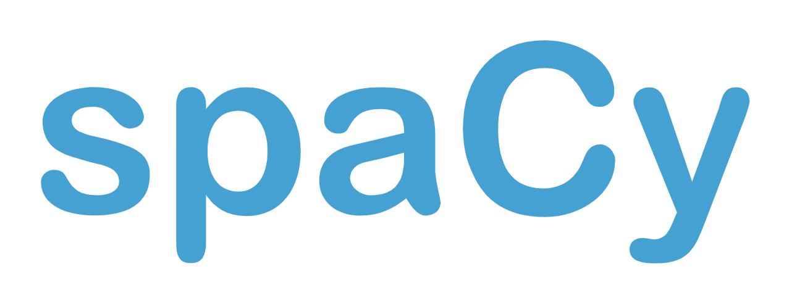

# Spacy Youtube Material 

This repository contains notebooks used in the youtube series found [here](https://www.youtube.com/watch?v=WnGPv6HnBok&list=PLBmcuObd5An559HbDr_alBnwVsGq-7uTF).

Before playing with the notebooks is would be good to download the stackoverflow dataset first. This can be found [here](https://www.kaggle.com/stackoverflow/stacksample).

- Here's [the notebook](https://github.com/koaning/spacy-youtube-material/blob/master/01-intro-to-spacy.ipynb) for [the first video](https://www.youtube.com/watch?v=WnGPv6HnBok&list=PLBmcuObd5An559HbDr_alBnwVsGq-7uTF).
- Here's [the notebook](https://github.com/koaning/spacy-youtube-material/blob/master/02-match-more-languages.ipynb) for [the second video](https://www.youtube.com/watch?v=KL4-Mpgbahw&list=PLBmcuObd5An559HbDr_alBnwVsGq-7uTF).
- Here's [the notebook](https://github.com/koaning/spacy-youtube-material/blob/master/03-labelling-evaluation.ipynb) for [the third video](https://www.youtube.com/watch?v=4V0JDdohxAk).
